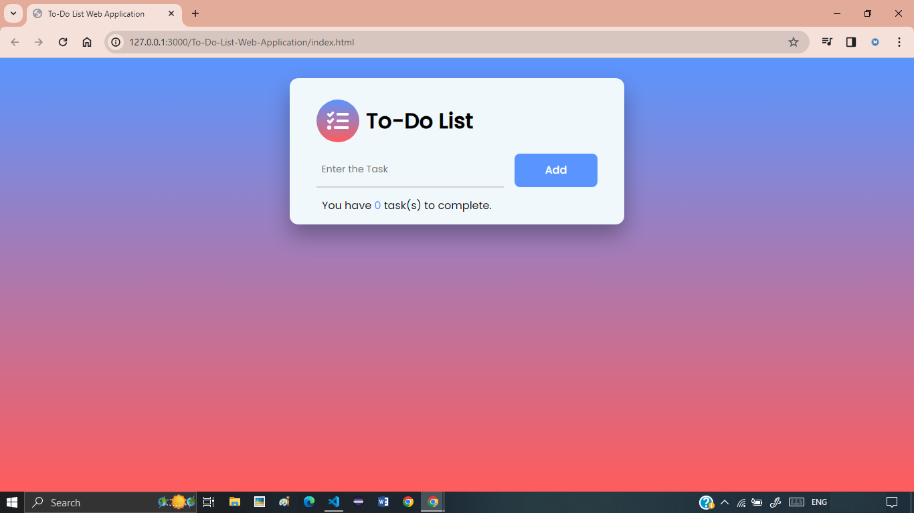
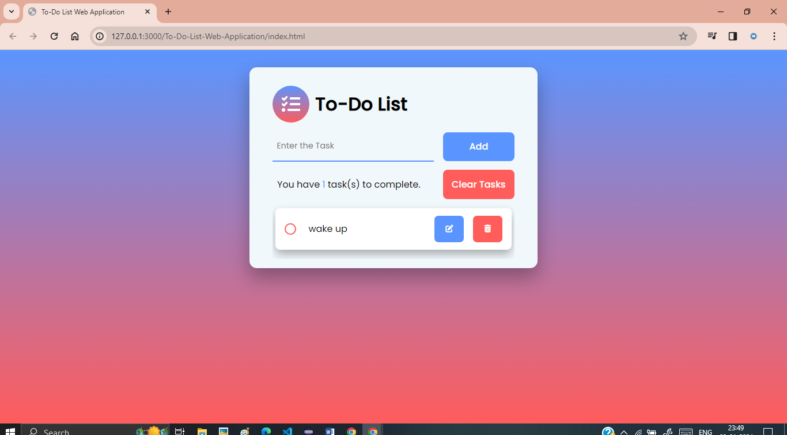
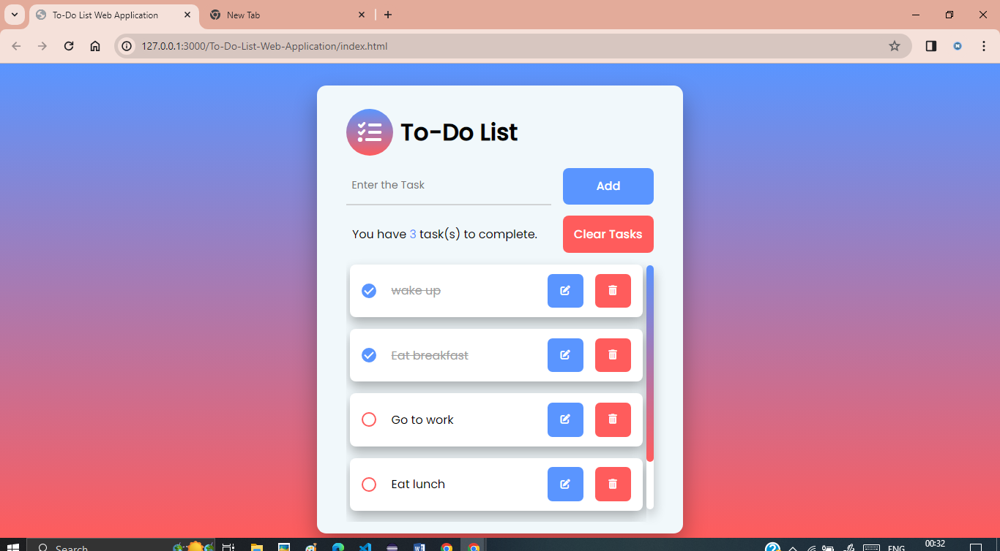

# To-Do-List-Web-Application

This is a to-do list web application, designed to assist you in efficiently managing and organizing your tasks. This application not only supports fundamental CRUD (Create, Read, Update, Delete) operations but also ensures that your task data persists even when you refresh or reload the page.

## Demo

[Link to live demo](https://navneet-singh01.github.io/To-Do-List-Web-Application/)

## Features

1. **Task Management**: Seamlessly create, read, update, and delete tasks with an intuitive user interface.

- Add tasks with a description.
- Mark tasks as completed.
- Edit existing tasks.
- Delete tasks individually.
- Clear all tasks at once.

2. **Data Persistence**: Your task data remains intact and readily available, even in the event of a page refresh or reload.

## Technologies Used

- HTML
- CSS
- JavaScript

## Screenshots

### 1. Screenshot 1

### 2. Screenshot 2

### 3. Screenshot 3

### 4. Screenshot 4

## Usage

### 1. Adding a Task:
- Type your task in the input field.
- Click the "Add" button.

### 2. Completing a Task:
- Check the checkbox next to a task.

### 3. Editing a Task:
- Click the "Edit" button next to a task.
- Update the task description.

### 4. Deleting a Task:
- Click the "Delete" button next to a task.

### 5. Clearing All Tasks:
- Click the "Clear Tasks" button.

## Author

Navneet Singh (https://github.com/Navneet-Singh01)